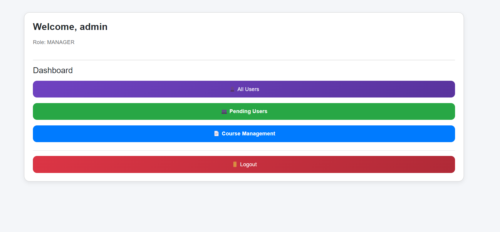
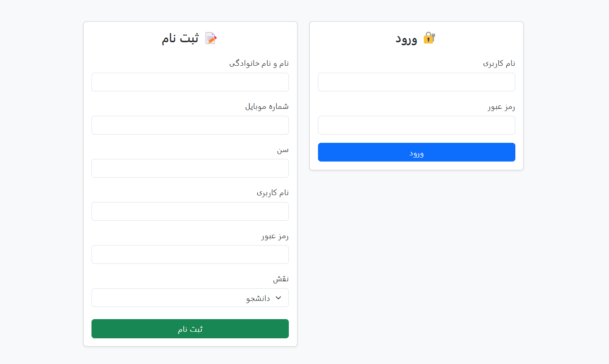
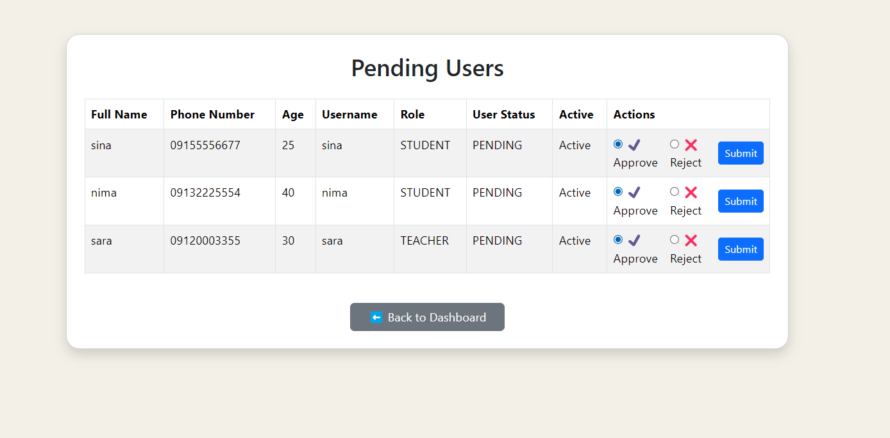
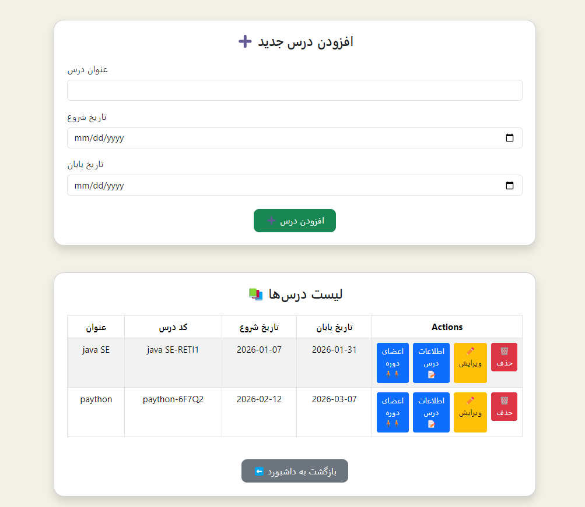
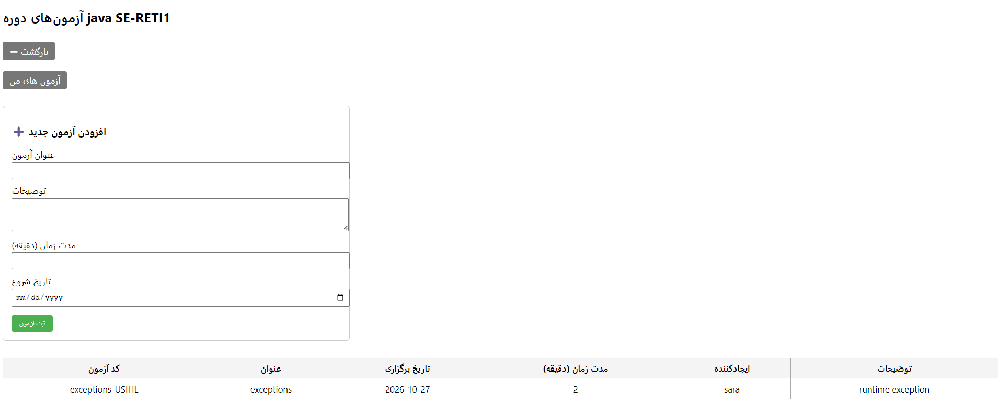
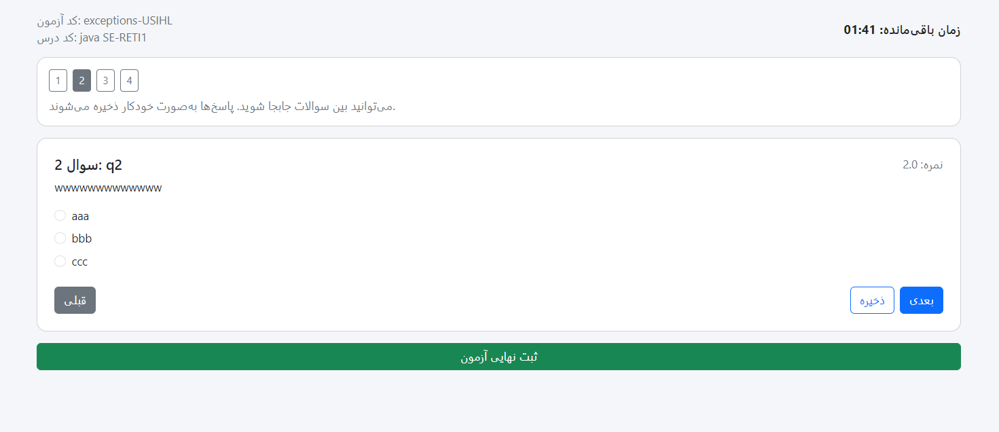
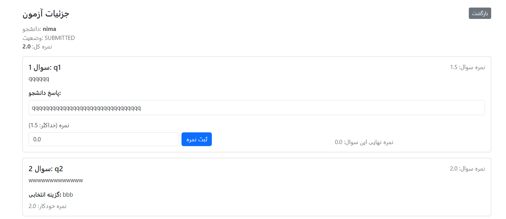

# Online Examination Management System 



A web-based application for creating, managing, and conducting online examinations.

This project was developed as a comprehensive educational platform where administrators, teachers, and students can interact through a role-based system to manage courses, exams, question banks, and grading processes.

## Features

### User Management

* User registration as Student or Teacher
* Account approval by Administrator
* User profile management
* User role management
* Search and filtering of users by different criteria
* Role-based access control

### Course Management

* Create, edit and delete courses
* Assign teachers to courses
* Enroll students in courses
* View course participants
* Course scheduling with start and end dates

### Examination Management

* Create and manage exams
* Define exam duration
* Edit and delete exams
* Associate exams with specific courses

### Question Bank

* Centralized question repository for each course
* Reusable questions across multiple exams
* Automatic storage of newly created questions

### Question Types

#### Multiple Choice Questions

* Dynamic number of options
* Configurable correct answer
* Automatic grading

#### Descriptive Questions

* Free-text answers
* Manual grading by teachers

### Exam Participation

* Student exam dashboard
* Timed examinations
* Countdown timer
* Navigation between questions
* Automatic exam submission after time expiration
* Temporary answer persistence during exam sessions

### Grading System

* Automatic grading for multiple-choice questions
* Manual grading for descriptive questions
* Per-question score configuration
* Exam score calculation
* Student result tracking

## System Roles

### Administrator

* Approve user registrations
* Manage students and teachers
* Manage courses
* Assign teachers to courses
* Enroll students in courses

### Teacher

* Create and manage exams
* Create and manage question banks
* Grade descriptive questions
* View exam results

### Student

* View enrolled courses
* Participate in exams
* Submit answers
* View exam participation status

## Technology Stack

### Backend

* Java
* Spring Boot
* Spring MVC
* Spring Security
* Spring Data JPA
* Hibernate

### Database

* PostgreSQL

### Frontend

* Thymeleaf
* HTML
* CSS
* Bootstrap

### Build & Tools

* Maven
* Git
* MapStruct
* Lombok

## Architecture

The application follows a layered architecture:

```text
Controller Layer
        ↓
Service Layer
        ↓
Repository Layer
        ↓
Database
```

Main architectural principles:

* Separation of Concerns
* DTO Pattern
* Repository Pattern
* Dependency Injection
* Layered Architecture

## Domain Model

Main entities include:

* User
* Student
* Teacher
* Course
* Exam
* Question
* Multiple Choice Question
* Descriptive Question
* ExamAttempt
* AttemptAnswer

## Security

* Authentication with Spring Security
* Password encryption using BCryptPasswordEncoder
* Role-based authorization
* Protected endpoints based on user roles

## Future Improvements

* REST API implementation
* JWT Authentication
* Docker support
* Unit and Integration Tests
* Email notifications
* Exam analytics dashboard
* Microservice architecture

## Screenshots

### Login Page



### Admin Dashboard


### User Management



### Course Management



### Exam Creation



### Exam Participation



### Grading Page


## Author

Davoud Sheikhi

GitHub:
https://github.com/DavoudSheikhi
